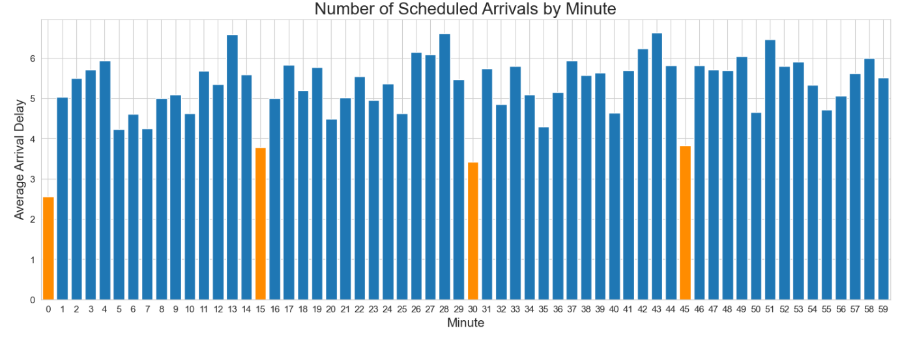
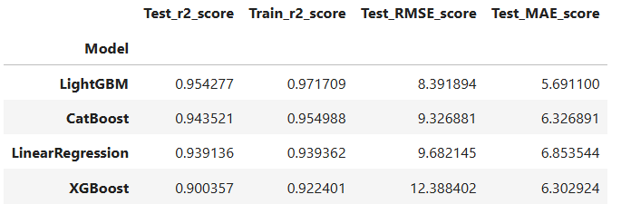
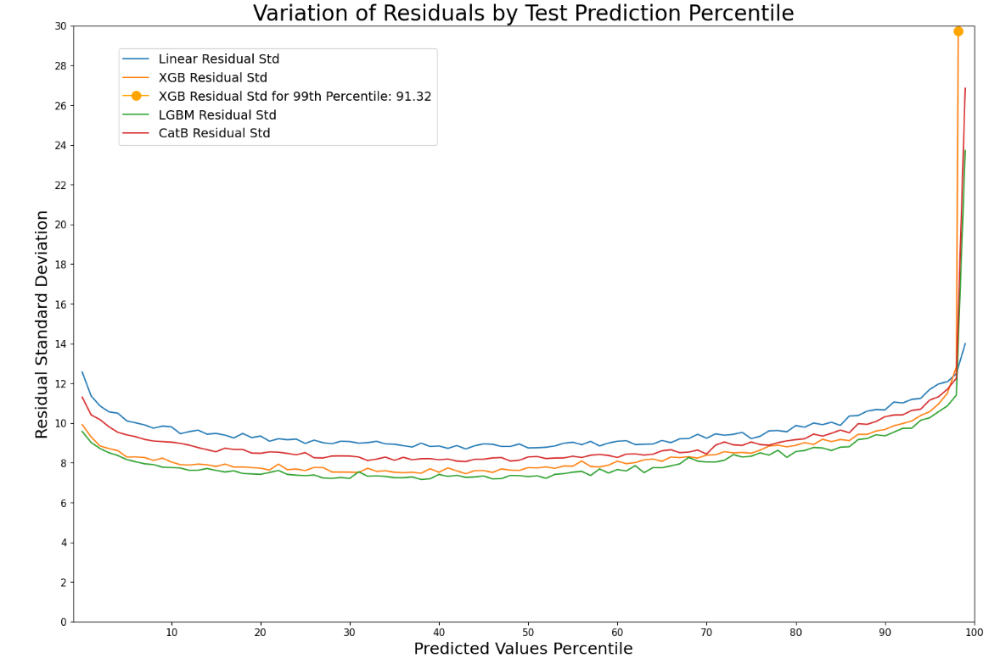
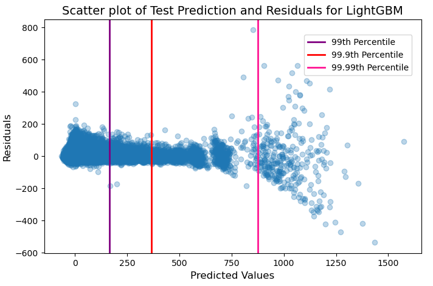
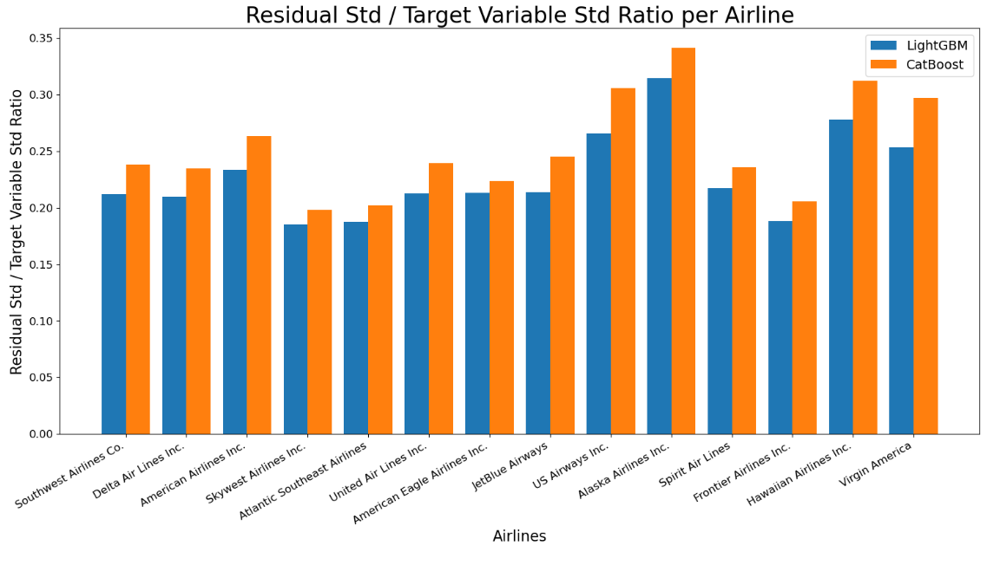

# Flight-Delay-Project

This is a python-based project to predict the flight delays of US domestic flights.  It uses historical data from: www.kaggle.com/datasets/usdot/flight-delays.
***
## Project Structure:
Data_Cleaning.ipynb - Loads and cleans the data, removes heterogeneous identifiers, and reconstructs timestamps.

Exploratory_Data_Analysis.ipynb - Visualises data, and uses statistical methods to explore relationships and variations in the data.

Flight_Predictions.ipynb - Optimises and evaluates multiple models to predict the "arrival delay" of flights utilising findings from my EDA.

## Findings and Results
 <br>
In my EDA, I found that features related to time often had discrete effects on the arrival delay so I treated them as categorical, rather than numerical, features in my predictions.  I also found that combinations of categorical features (such as airline and origin airport) explained a significant amount of the variation in arrival delay.

To Predict the arrival delay of flights:
- I used LinearRegression, due to the linear relationship between the embedded feature, "departure delay", and arrival delay.

However, due to my EDA, I hypothesised that complex relationships between the categorical features would help to explain the variation in arrival delay so I utilised 3 Gradient Boosting models as well:

- XGBoost as a baseline.
- LightGBM, due to its deep assymetrical trees, to better capture complicated feature interactions.
- CatBoost, which only performs one split per level, in case large consistent patterns in the data best explained the variation.<br>

<br>

 <br>
LightGBM, as expected, was the best performing model, although with slight overfitting.  Whilst all the models explained a huge amount of variation of arrival delay (which has a standard deviation of 39) this is unfairly high due to the embedded feature departure delay.  By mean absolute error, XGBoost was the 2nd best, although it was the worst when evaluating using root mean squared error.  This is because of the model having a high variance for very large arrival delays as we can see in the next image.<br>

<br>

 <br>
None of the models are homoscedastic, all having significant residual variation, especially for the 99th percentile of predicted values.  LinearRegression was the worst performing model because of its inability to capture the relationships between features and LightGBM was the best performing gradient boosting model for every percentile.  The variation between XGBoost's MAE and RMSE is explained by its disproportionately high residual error for large values.  However, LinearRegression's stronger performance in the 99th percentile shows that the gradient boosting models aren't effectively splitting the departure delay feature for very large values.<br>

<br>

<br>
When we look at the variation of residuals and predicted values for LightGBM, there is and increased error for very large values.  Therefore, I believe that due to the high variance and low sample size of values in the upper tail, the gradient boosting models aren't splitting this part of the data by departure delay leading to worse performance.<br>

<br>

<br>
In my model error analysis, there wasn't a clear pattern between the airline and the amount of variation that the models explained.  The 2 airlines with the lowest proportion of their variation explained, Alaska and Hawaiian, also had the lowest overall variation.  This suggests that a larger proportion of their variation (and therefore the variation present in the graph) is due to noise.  We can also see that for the 2 best performing models, LightGBM and CatBoost, there isn't significant variation, between their performances, by airline.

Overall, LightGBM was the best performing model, even though it is less effective at predicting very large delays than LinearRegression.  Future work can be done to predict the arrival delay without relying on embedded features.

## Installation
```
git clone www.github.com/Samuel-Kelly-hub/Flight-Delay-Project
cd Flight-Delay-Project
pip install -r requirements.txt
```
## How to Run Notebooks
```
jupyter notebook
```
Run the notebooks in the following order:
1. `Data_Cleaning.ipynb`
2. `Exploratory_Data_Analysis.ipynb`
3. `Flight_Predictions.ipynb`
